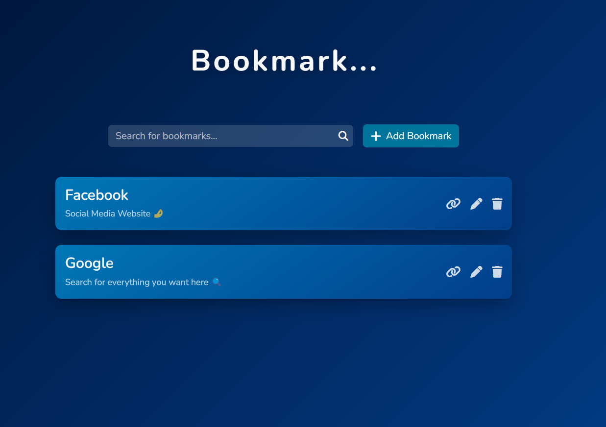

# 📌 Bookmark Manager

**Bookmark** is a simple and responsive Bookmark Manager built with **HTML**, **CSS**, **JavaScript**, and **Bootstrap 5**. It allows users to **add, edit, delete, and search** their favorite websites with a clean and animated interface focused on accessibility and smooth user experience.

### 🌐 Live Demo: [Bookmark App](https://bookmark-mz.vercel.app/)

## 📸 Preview



---

## 🧠 Key Concepts

### 🎨 Autofill Styling

Browsers apply default autofill styles that can clash with custom themes. To maintain a consistent dark UI, the following CSS rules were applied:

```css
.bookmark-form input:-webkit-autofill {
  -webkit-text-fill-color: #f8f9fa;
  -webkit-box-shadow: 0 0 0px 1000px #000 inset;
  transition: background-color 5000s ease-in-out 0s;
}
```

#### ✴️ Explanation

* **`-webkit-autofill`** targets inputs filled automatically by the browser.
* **`-webkit-text-fill-color`** ensures the autofilled text color matches the design theme.
* **`-webkit-box-shadow`** removes the default yellow/blue background by using an inset shadow.
* **`transition`** adds a smooth visual effect to prevent flicker during autofill animation.

#### 💡 Takeaway

This customization keeps the autofill effect visually consistent with the app’s overall dark aesthetic and enhances the polished, professional look of form inputs.
